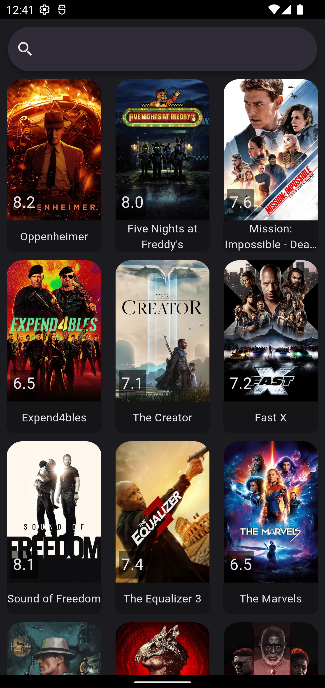
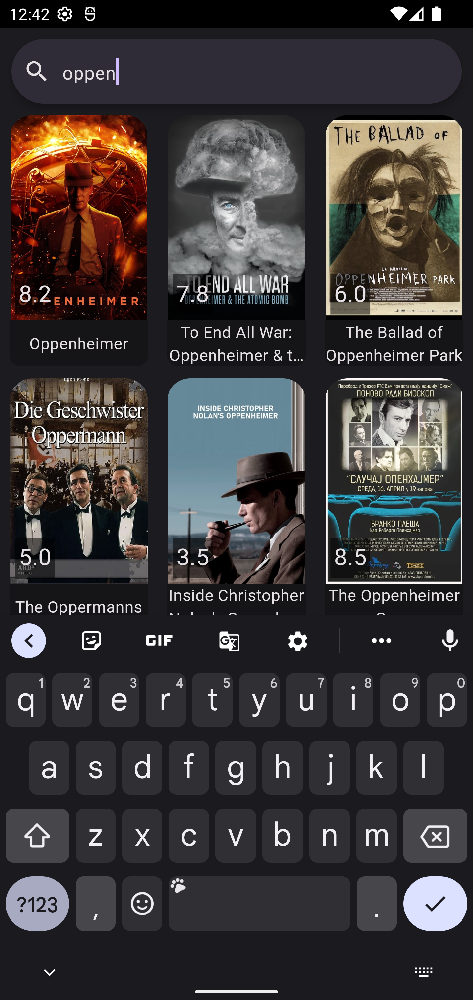

# Movie Case Flutter Application

This Flutter application is an example developed using the [The Movie Database (TMDb)](https://www.themoviedb.org/) API, implementing GetX state management, and adhering to Clean Architecture principles.

## Features

- **List Movies:** Fetches popular movies from the TMDb API and displays them to the user.
- **Movie Search:** Allows the user to search for movies by name or keyword.
- **Detailed Information:** Provides detailed information for each movie.

## Technologies and Libraries

- [Flutter](https://flutter.dev/): Google's UI toolkit for building natively compiled applications for mobile, web, and desktop.
- [GetX](https://pub.dev/packages/get): A lightweight, powerful, and easy-to-use Flutter state management library.
- [Dio](https://pub.dev/packages/dio): A powerful library for making HTTP requests.
- [Clean Architecture](https://blog.cleancoder.com/uncle-bob/2012/08/13/the-clean-architecture.html): An architectural approach based on clean code principles.

## Screenshots

